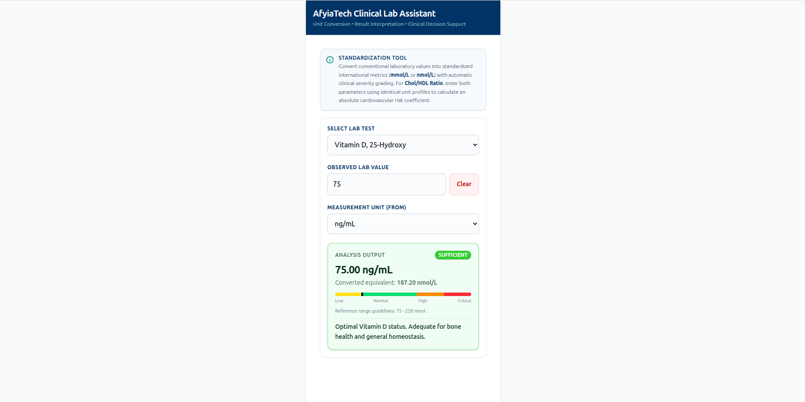
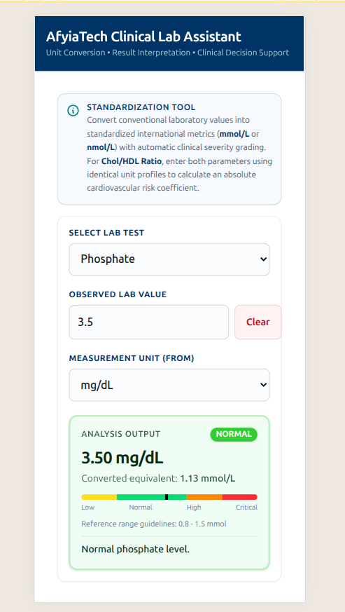

# 🧪 AfyiaTech Lab Assistant (PWA)

[](https://app.netlify.com/projects/afyiatech-lab-assistant/deploys)


A lightweight, installable, enterprise-grade **Progressive Web App (PWA)** built to standardize conventional laboratory values into international metric equivalents (**mmol/L** and **nmol/L**) with automatic real-time clinical severity grading.

Designed with a high-performance, completely serverless, offline-first architecture, this application behaves like an ultra-responsive native utility on both mobile and desktop screen form factors.

---

## 🚀 Live Environment Hub

| Deployment Vector | Target Location Link | Deployment Status |
| :--- | :--- | :--- |
| **🌐 Live Production Application** | [https://afyiatech-lab-assistant.netlify.app](https://afyiatech-lab-assistant.netlify.app) | [](https://app.netlify.com/projects/afyiatech-lab-assistant/deploys)|
| **📦 Controlled Source Code** | [https://github.com/Amoswasike/afyiatech-lab-assistant](https://github.com/Amoswasike/afyiatech-lab-assistant) | `main branch` |

---

## ⚡ Visual Architecture & Form Factors

### 💻 Desktop Experience
<kbd>
  
</kbd>

### 📱 Mobile Experience
<div align="left">
  
</div>

---

## ✨ System Operations & Core Scope

AfyiaTech Lab Assistant mirrors real-world clinical laboratory workflows by parsing unstructured, highly localized mass inputs and resolving them into clean, universally referenceable diagnostic outcomes.

```text
[Raw Input Value] ──► [Conversion Matrix] ──► [SI Normalization] ──► [Severity Brackets] ──► [Dynamic UI Sync]

```

* **Convert Lab Values Across Medical Units:** Translates values across multiple distinct formats seamlessly.
* **Normalize Values to Standard Clinical Units:** Resolves variables directly into uniform international molar baselines (`mmol/L` or `nmol/L`).
* **Evaluate Against Reference Ranges:** Cross-references patient values with strict laboratory parameters instantly.
* **Flag Abnormal/Critical Results Instantly:** Isolates critical deviations using clear, high-visibility, color-coded visual alerts.
* **Compute Cholesterol/HDL Ratio Automatically:** Features a specialized dual-input mode that calculates unitless absolute cardiovascular risk coefficients.

---

## 🎨 Enterprise Feature Cards

### 🔬 Laboratory Intelligence Engine

* **Multi-Test System:** Scalable reference profiles for Phosphate, Magnesium, Uric Acid, and Vitamin D.
* **Standardization Normalization:** Implements pure mathematical precision handling for complex metric conversion factors without drifting decimals.
* **Clinical Reference Validation:** Dynamically tracks diagnostic boundaries based on clinical literature.

### 📊 Result Interpretation Matrix

* **Dynamic Severity Tiers:** Instantly flags inputs across `LOW`, `NORMAL`, `HIGH`, `INSUFFICIENCY`, and `CRITICAL` statuses.
* **Visual Semantic Grading:** Adapts layout surfaces dynamically using specific corporate brand tones:
* 🟢 **Optimal Profile:** Brand Green (`#32CD32`) for reassuring health baselines.
* 🟡 **Caution Window:** Warm yellow for borderline metabolic abnormalities.
* 🔴 **Emergency Flag:** Pulsating crimson red alerting practitioners to panic values.


### 📱 Progressive Web App (PWA) Pipeline

* **Zero Backend Overhead:** Pure client-side calculations mean instantaneous responses and reduced network request failure modes.
* **Resilient Service Worker Caching:** Explicitly intercepts fetch routines to serve cached assets offline in low-connectivity hospital baselines.
* **Adaptive Android Icons:** Uses a dedicated `icon-maskable.png` file to fit device launch grids perfectly without ugly white border rings.

---

## 🛠️ Technology Stack & Execution Matrix

| Architecture Layer | Component Technology Stack | Engineering Implementation Purpose |
| --- | --- | --- |
| **Visual Layer (UI)** | HTML5 semantic primitives + Tailwind CSS v4 | Lightweight styling engine utilizing native custom `@theme` variables for fast rendering performance. |
| **Logic & Engine** | JavaScript Vanilla ES Modules (`ES6+`) | Pure functional calculations, strict block scope scoping, zero third-party dependency creep. |
| **PWA Threading** | Service Worker Proxy API + Web Manifest | Advanced client-side caching mechanism for offline resiliency and system independence. |
| **State Layer** | Modular Object-Oriented State Store (`state.js`) | Centralized state tracking managing input updates cleanly across decoupled view layers. |

---

## ⚙️ How It Works

1. **Select Laboratory Test:** The practitioner interacts with the main test picker dropdown.
2. **Dynamic UI Re-rendering:** `ui.js` detects selection hooks, dynamically updating helper dropdown parameters and setting appropriate accessibility fields.
3. **Data Ingestion:** The clinician inputs values (e.g., conventional `mg/dL`) via mobile keypad.
4. **Calculations:** `conversions.js` standardizes the metrics, while matching references evaluate range targets.
5. **Output Delivery:** The application opens the result block, modifying theme elements to convey clinical urgency.

1. **Trigger Ratio Mode:** Choosing **Cholesterol / HDL Ratio** instantly changes the interface form layout.
2. **Input Isolation:** The standard single-value input collapses out of view, and explicit fields for Total Cholesterol and HDL slide in accessibly.
3. **Cross-Unit Calculation:** The user fills out both fields using identical unit metrics.
4. **Outcome Evaluation:** The module computes the raw mathematical fraction, outputting a clear cardiovascular risk assessment summary:
* **Ratio < 3.5:** Optimal cardiovascular profile.
* **Ratio 3.5 – 5.0:** Borderline elevated risk profile.
* **Ratio > 5.0:** High-risk critical atherogenic tracking category requiring immediate clinical notice.


---

## 📂 Project Architecture

```text
AFYIATECH-LABS/
├── assets/                  # Scalable Branding, Favicons, and Launcher Icons
│   ├── apple-touch-icon.png
│   ├── favicon.ico
│   ├── icon-16x16.png
│   ├── icon-32x32.png
│   ├── icon-192x192.png
│   ├── icon-512x512.png
│   └── icon-maskable.png     # Android Adaptive Workspace Adaptive Icon Safe-Zone
├── js/                      # Modular Object-Oriented Frontend Logic
│   ├── conversions.js       # Mathematical Formulations and Unit Modifiers
│   ├── data.js              # Reference Range Limits and Typography Strings
│   ├── script.js            # Main Core App Orchestrator & PWA Event Handler
│   ├── state.js             # Centralized Immutable Application State Manager
│   └── ui.js                # High-Speed DOM Manipulation & Accessibility Controls
├── screenshots/             # Manifest Presentation Mockups
│   ├── desktop.png          # App View Capture Profile (1847x922)
│   └── mobile.png           # App View Capture Profile (493x973)
├── src/                     # Stylesheet Source Directory
│   ├── input.css            # Tailwind Imports & Custom Branded `@theme` Directives
│   └── output.css           # Production-Compiled Native Utility Styles
├── .gitignore               # System Environment Flag Filters
├── index.html               # Standard Application Shell Template Markups
├── manifest.json            # PWA Application Context & Configuration Rules
├── package.json             # Build Automation Shell Controls
└── service-worker.js        # Offline Caching Proxy Engine Thread

```

---

## 🎯 Recruiter & Technical Engineering Impact

This application is built as a production-grade portfolio showcase demonstrating advanced browser-native optimization techniques:

* **Zero Frame Drop Rendering:** Direct DOM targeting in `ui.js` completely avoids heavy framework reconciliation loops (such as Virtual DOM overheads), allowing the application to render instantly even on low-end mobile hardware.
* **A11Y Compliant Design:** Built with comprehensive focus management ring overrides, screen-reader semantic aria tracking controls (`aria-live="polite"`, `aria-hidden`), and high-contrast styling boundaries that meet WCAG AAA visibility parameters.
* **Strict Code Maintenance Guidelines:** Clean separation of concerns between data layers (`data.js`), pure mathematical calculation abstractions (`conversions.js`), and view state bindings ensures features can be added smoothly without regression bugs.

---

## 🗺️ Engineering Development Roadmap

* [ ] **Data Visualization Layer:** Integrate lightweight SVG or Canvas trend-line components to visually place the patient's score along a spectrum of standard ranges.
* [ ] **Local Storage History Tracking:** Cache previous conversion runs locally on the user's device using encrypted IndexedDB or LocalStorage structures.
* [ ] **System-Wide Dark Mode:** Add an automated dark theme utility linked to system-level preferences to reduce eye strain in low-light night shifts.
* [ ] **AI-Assisted Interpretation Engine:** Incorporate edge-based NLP parsing utilities to handle unstructured clinical text fragments.

---

## ⚠️ Medical Disclaimer

This tool is constructed exclusively for technical evaluation, workflow reference acceleration, and educational validation metric profiling. It does not replace independent clinical diagnosis, formalized laboratory information systems (LIS), or direct expert medical intervention channels.

---

## 👨‍💻 Engineering Author

**Amos Wasike (Wako)** *Graphic Designer | Motion Creator | Frontend Developer | PWA Evangelist | Modern UI Systems Builder*

* **GitHub:** [@Amoswasike](https://www.google.com/search?q=https://github.com/Amoswasike)
* **Specialties:** Progressive Web Applications, Responsive Clean Code Architecture, Fluid Interface Layouts.

